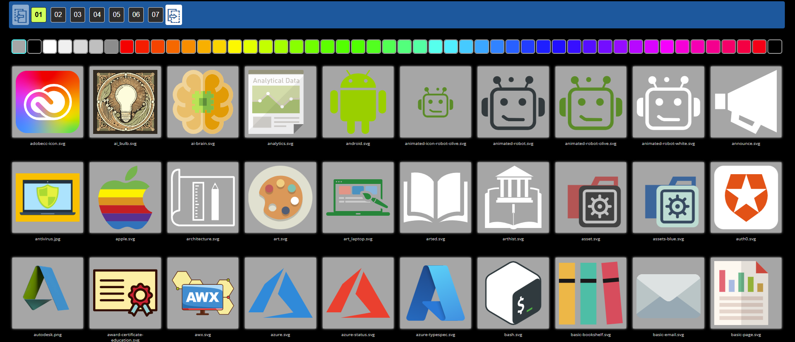
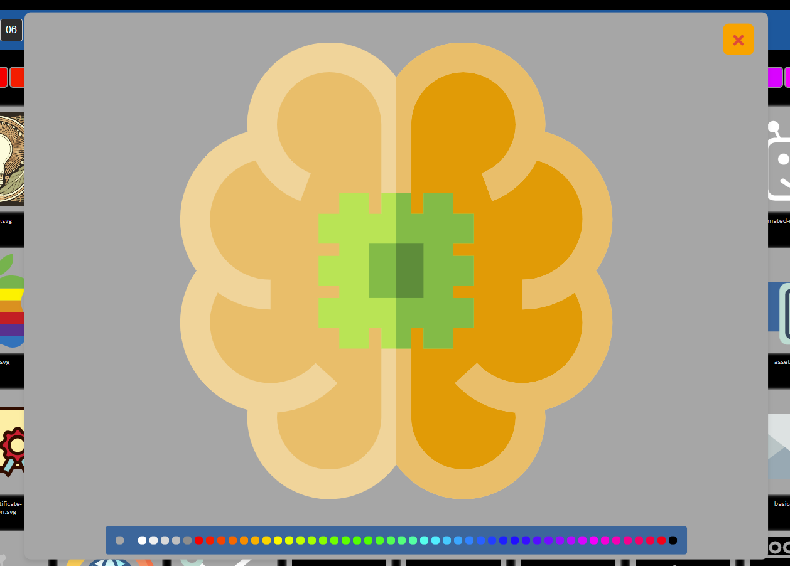

<table>
  <tr>
    <td></td>
    <td><h1>Deisgner Gallery</h1></td>
    <td><p>The logo is courtesy of <a href="https://www.svgrepo.com/svg/253939/gallery" alt="CCO SVGRepo Image" title="CCO SVGRepo settings gear logo">SVG Repo</a></p></td>
  </tr>
</table>

[DEMO](https://divisionbyinfinity.github.io/gallery/)
<br>


- [Introduction](#introduction)
- [HTML Example](#html-example)
- [CSS](#css)

## Introduction
This is a simple bit of code and html that adds an image gallery to a website.  You can change the background color to see how images appear with different background colors and click on the image to enlarge (brings it up in a modal).  I really made it to help select avatars and logos for other web apps and sites.  The next and previous buttons fade (opacity) when there is not a page to go forward or back to and it has a scroll-to-top buttton.  Just put the list of images you want in the gallery in the index.dat - you can use paths so you can have images from throughout your website in the gallery in one place. Fairly simple and straight forwward to use.

[

[


## HTML Example

```html 
<body id="top"> <!-- This is the anchor for the Scroll-To-Top Button at the bottom of the page-->
<div class="page_container">
<div id="imageModal" class="modal">
<div id="colorOptions">
<div class="colorBox" id="Box_1"></div>
<div class="colorBox" id="Box_2"></div>
<div class="colorBox" id="Box_3"></div>
<div class="colorBox" id="Box_4"></div>
</div>
<span class="close">&times;</span>

</div>
<div class="pagination" id="pagination">
<button id="prevPage">⎗</button>
</div>
<div class="gallery-container">
<div id="gallery"></div>
</div>
</div>
<button id="scrollTop"
  type="button"
  onclick="window.scrollTo({ top: 0, left: 0, behavior: 'smooth' });">Back to Top</button>

<script src="example_gallery.js"></script> <!-- Just reference the script before closing the body -->
<body>
```

## CSS

```css
html {
    --primedgr: #44611F; --pdgr-rgba: rgba(68, 97, 31, 1);
    --primelgr: #C5E1A5; --plgr-rgba: rgba(197, 225, 165, 1);
    --primelgr: #C5E1A5; --primelgr-rgba: rgba(197, 225, 165, 1);
    --primedbl: #336699; --primedbl-rgba: rgba(51, 102, 153, 1);
    --primelbl: #B3E5FC; --primelbl-rgba: rgba(179, 229, 252, 1);
    --primered: #C0392B;
    --primeora: #ffa500; 
    --primeblu: #01579B;
    --primebla: black;
    --primewhi: white;
    --logoback: #44611F;
    }
    
    body {
    background: var(--primebla);
    color: var(--primewhi);
    font-family: "Noto Sans", sans-serif;
    font-optical-sizing: auto;
    -webkit-font-smoothing: antialiased;
    -moz-osx-font-smoothing: grayscale;
    margin: 0;
    padding: 0;
    width: 100%;
    max-width: 100%;
    box-sizing: border-box;
    overflow-x: hidden;          /* ← This is the key to prevent horizontal scrolling */
    }

    .page_container {
    display: flex;
    margin: auto;
    flex-direction: column;
    align-items: center;
    justify-content: center;
    width: 97%;
    max-width: 97%;
    box-sizing: border-box;
    }
        
    .pagination {
    display: flex;
    flex-wrap: wrap;
    justify-content: left;
    align-items: center;
    width: 100%;
    margin: 1rem 0 1.25rem 0;
    gap: .5rem 0;
    background-color: #01579b;
    padding: .5rem .5rem;
    box-sizing: border-box;
    border-radius: 4px;
    }
    
    .page-link {
    margin: 0 5px;
    padding: .5rem;
    color: white;
    background-color: #2d2c2c;
    border: 1px solid #ccc;
    border-radius: 4px;
    text-decoration-color: transparent !important;
    font-size: 1rem;
    }
    
    a.page-link:link,
    a.page-link:visited,
    a.page-link:hover,
    a.page-link:active {
    text-decoration-color: transparent !important;
    }
    
    button.page-link:hover {
    background-color: #B9DCD2 !important;
    color: black !important;
    }
    
    button.page-link.active {
    background-color: #336699;
    text-decoration-color: transparent !important;
    color: white;
    }
    
    /*
    .spacer {
    width: 39px;
    height: 39px;
    } */
    
    #prevPage,
    #nextPage {
    background-color: white; 
    color: #336699;
    font-size: 3rem;
    border: 0;
    border-radius: 4px;
    padding: 0!important;
    font-weight: 800;
    line-height: 1;
    width: 39px!important;

    }
    
    #prevPage:active,
    #nextPage:active {
    background-color: #C0392B !important;
    color: #ffa500 !important;
    }
    
    #prevPage:hover,
    #nextPage:hover {
    background-color: #B9DCD2;
    color: black;
    }
    
    .modal {
    display: none;
    position: fixed;
    z-index: 1;
    left: 50%;
    top: 50%;
    width: 60%; /* Or any specific size */
    max-width: 60%; /* Maximum width to not exceed the viewport */
    height: 80%;
    max-height: 80%; /* Maximum height to not exceed the viewport height */
    transform: translate(-50%, -50%);
    padding: 1rem;
    background-color: #292929;
    border-radius: 10px;
    box-shadow: 0 4px 8px rgba(0, 0, 0, 0.1);
    justify-content: center;
    align-items: center;
    overflow: hidden;
    text-align: center;
    margin: auto;
    }
    
    
    .modal-content {
    width: 100%;
    height: 100%;
    max-width: 100%; /* Ensures the image's max width is 100% of its container */
    max-height: 100%; /* Ensures the image's max height is 100% of its container */
    object-fit: contain; /* Ensures the image maintains its aspect ratio */
    }
    
    
    .close {
    color: #E74C3C;
    background: #ffa500;
    position: absolute;
    top: 5%;
    right: 47px;
    transform: translate(50%, -50%);
    font-size: 40px;
    font-weight: bold;
    cursor: pointer;
    height: 50px;
    width: 50px;
    line-height: 50px; /* Center the text vertically */
    text-align: center;
    border-radius: 10px;
    }
    
    .close:hover,
    .close:focus {
    color: #ffa500;
    background:#E74C3C;
    text-decoration: none;
    cursor: pointer;
    border-radius: 10px;
    }
    
    #colorOptions {
    position: absolute;
    top: 20%;
    right: 20px;
    transform: translateY(-50%);
    display: flex;
    flex-direction: column;
    align-items: center;
    gap: .5rem;
    background: #336699;
    padding: 1rem;
    border-radius: 10px;
    
    }
    
    .colorBox {
    width: 20px;/* Adjust size as needed */
    height: 20px; /* Adjust size as needed */
    border-radius: 5px; /* Optional for rounded corners */
    }
    
    html {
    --box-bg1: black;
    --box-bg2: white;
    --box-bg3: #7F8C8D;
    --box-bg4: red;
    }
    
    #Box_1 { background-color: var(--box-bg1); }
    #Box_2 { background-color: var(--box-bg2); }
    #Box_3 { background-color: var(--box-bg3); }
    #Box_4 { background-color: var(--box-bg4); }
    
    .gallery-container {
      display: flex;
      justify-content: center;
      align-items: center;
      flex-direction: column;
      width: 100%;
      max-width: 100%;
      margin: 0 auto 2rem auto;
      padding: 0;
      box-sizing: border-box;
  }
  

  
  #gallery {
      display: flex;
      flex-direction: row;
      flex-wrap: wrap;
      align-items: flex-start; /* Align items to the top */
      justify-content: flex-start; /* Align items to the left */
      margin: 0 auto;
      width: 100%; /* Ensures the container takes the full width */
      max-width: 100%; 
      padding: 0;
      gap: 0;
      box-sizing: border-box;
  }
    .image-wrapper {
    position: relative;
    display: flex;
    align-items: center; /* Keeps content vertically centered in each .image-wrapper */
    justify-content: center; /* Changed from flex-start to center to horizontally center the content within each .image-wrapper */
    flex-direction: column;
    overflow: hidden; /* Hide any overflow */
    padding: .5rem;
    margin: 0;
    width: 6.25%; /* 12.5% */
    max-width: 6.25%; /* 12.5% */
    box-sizing: border-box;
    }
    
    .image-container {
    display: flex; /* Utilize flexbox for centering */
    justify-content: center; /* Center horizontally */
    align-items: center; /* Center vertically */
    width: 100%; /* Adjusts width based on content */
    max-width: 100%; /* Ensures image doesn't exceed container width */
    aspect-ratio: 1 / 1; /* Makes the height equal to the width */
    position: relative; /* This makes it a reference for absolutely positioned inner elements */
    background-color: #2E4053;
    box-shadow: #fff 0 0 5px;
    overflow: hidden; /* Hide any overflow */
    }
    
    .image-container img {
    width: calc(100% - 1rem); /* Adjusts width based on content */
    max-width: calc(100% - 1rem); /* Ensures image doesn't exceed container width */
    height: calc(100% - 1rem); /* Adjusts height based on content */
    max-height: calc(100% - 1rem); /* Ensures image doesn't exceed container height */
    object-fit: contain; /* Keeps aspect ratio without cropping */
    padding: .5rem;
    overflow: hidden; /* Hide any overflow */
    }

    .image-container:hover {
    box-shadow: #01579B 0 0 5px 2px;
    background-color: #00A9E0;
    border-radius: 4px;
    }
    
    .image-container:active {
    
    }
    
    .caption-container {
    display: block;
    width: 90%;
    text-align: center;
    margin: 0 auto;
    color: #ccc;
    padding: .5rem 0;
    height: 1.7rem;
    max-height: 1.7rem;
    font-size: .65rem;
    line-height: 1.25;
    }
    
    
    a.nostyle {
    color: inherit;
    text-decoration: inherit;
    cursor: grab;
    border: none!important;
    outline: none!important;
    box-shadow: none!important;
    background-color: transparent;
    /* no underline */
    }
    
    a.nostyle:hover {
    color: inherit;
    background-color: inherit;
    /* no underline */
    }
    
    a.nostyle:active {
    color: inherit;
    background-color: inherit;
    /* no underline */
    }
     
    @media screen and (max-width: 1400px) {
    .image-wrapper {
    flex: 1 1 calc(20%); /* Adjust size as necessary, accounting for the gap */
    max-width: calc(20%); /* Max width for each image wrapper */
    }
    .caption-container {
      font-size: .8rem;
    }
    }
    
    
    @media screen and (max-width: 900px) {
    .image-wrapper {
    flex: 1 1 calc(33% - 1rem); /* Adjust size as necessary, accounting for the gap */
    max-width: calc(33% - 1rem); /* Max width for each image wrapper */
    }
    
    #colorOptions {
    position: absolute;
    left: 1rem;
    top: 5%;
    transform: translateY(-50%);
    display: flex;
    flex-direction: row!important;
    align-items: center;
    gap: 10px;
    background: #336699;
    padding: 1rem;
    border-radius: 10px;
    width: fit-content;
    }
    
    .colorBox {
    width: 15px!important;/* Adjust size as needed */
    height: 15px!important; /* Adjust size as needed */
    border-radius: 5px; /* Optional for rounded corners */
    }
    
    #gallery {
    justify-content: center;
    }
    
    .modal {
    width: 95%; /* Or any specific size */
    max-width: 95%; /* Maximum width to not exceed the viewport */
    }
    }

    #scrollTop {
    position: fixed;
    bottom: 20px;
    right: 20px;
    }
```

Have fun.
